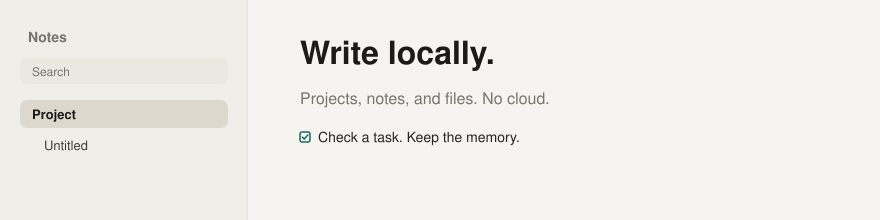

# Notes

Local projects, notes, and files. Offline. Yours.



A small desktop app for Windows and Linux. Projects on the left. A real editor on the right. Attachments stay on disk. Search lives in a local SQLite index.

## Features

- Projects you can reorder by dragging
- Notes with headings, lists, and checkboxes
- Files attached to a project or a note
- Local search across titles, text, and files
- Color themes and language: English, Portuguese, Spanish
- No account. No cloud.

## Run

```bash
npm install
npm run dev
```

Requires Node.js 22.5+.

## Package

```bash
npm run build:linux
```

The runnable archive lands in `release/` as `notes-1.0.0.tar.xz`.

Unpack and run the binary inside. Notes are stored in the app user-data folder (`notes.db` + `files/`).

## Test

```bash
npm test
```

Headless. No mouse, keyboard, or screen capture.

## License

MIT
